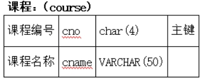
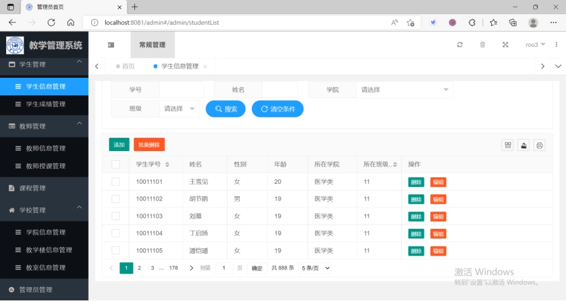
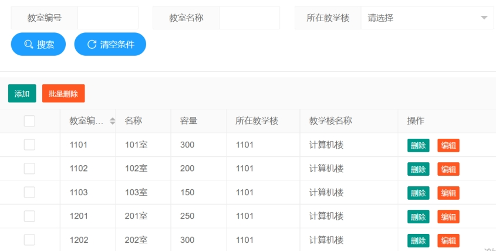
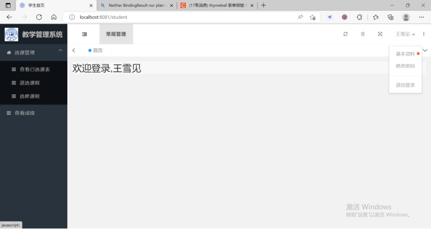

# 总体设计

课程要求：

一个简易的教学管理系统，该系统的用户包括学生、教师与管理员。其中：

1、学生可以管理自己的信息，选课；

2、教师可以管理自己的信息、自己所教课程管理、成绩管理；

3、管理员对课程信息进行管理；

4、根据教学管理系统需要，自行设计相应功能。

# 使用技术

* 语言：Java 1.8
* 开发工具：IDEA 2021

* 框架：SpringBoot、Spring、SpringMVC、Mybaties

* 前端模板：Layui-mini

# 数据库设计

## 管理员表

 

 

数据：

## 学生表

 

 

部分数据：

## 教师表

 

 

部分数据：

## 课程表

 

 

部分数据：

## 教室表

 

 

部分数据：

## 教学楼表

 

 

数据：

## 学院系表

 

 

部分数据：

## 学生成绩表

 

 

部分数据：

## 授课表

 

 

部分数据：

# **功能设计**

## 系统设计流程

教学管理系统的用户包括学生、教师与管理员。不同身份拥有不同的系统权限，通过在登录页面选择身份，可以进入不同的后台模块。

 

如上图显示，本系统工分为四个模块，即登录模块、管理员模块、学生模块、教师模块，接下来介绍各个模块的功能设计：

# （一）**登录模块**

登录中需要录入账号和密码以及选择身份，根据不同身份，到相应的数据库表查看是否存在对应账号。

 

# （二）**管理员模块**

管理员模块首页如下

 

-在首页和右上角都会显示管理员的账户名

-在右上角的基本资料中管理员可以管理个人信息，即查看和修改个人资料，管理员编号不可修改，可以修改管理员姓名。

 

-在右上角的修改密码中可以修改当前账户的密码，修改成功后会自动退出系统要求重新登录

 

-在左边显示了管理员所拥有的权限，即可以进行的操作管理，管理员所拥有的权限总结如下：

 

 

### 1. 学生管理

学生管理包括学生信息管理，学生成绩(选课)管理两个部分

#### 学生信息管理

 

-增加学生，要求学号唯一，密码默认为123456，所在学院和所在班级都使用下拉框来选择，保证学生表的学院满足学院表的外键约束

 

-删除学生，学生被删除后，这位学生相关的选课记录也一并被删除了，可以删除一个学生也能批量删除学生

-修改学生，可以修改学生的姓名、性别、年龄、所在学院、所在班级

-查找学生，可以通过学号、学院、班级准确查找，也使用了操作符like来实现姓名的模糊查询

 

#### 学生成绩(选课)管理

 

-增加学生选课记录，要求存在学号和授课编号满足外键约束

-删除学生选课记录，可以删除一条学生选课记录也能批量删除记录

-修改学生课程分数，可以修改某位学生在某节课的分数，分数可以为NULL

-查找学生选课和课程分数，可以通过学生学号、授课编号准确查找某个学生在某个授课的分数

### 2. 教师管理

教师管理包括教师信息管理，教师授课管理两个部分

#### 教师信息管理

 

-增加教师，要求教师编号唯一，密码默认为123456，所在学院使用下拉框来选择，保证教师表的学院满足学院表的外键约束

-删除教师，教师能被删除要求这名教师没有课程要讲授了，可以删除一个教师也能批量删除多名教师

 

-修改教师信息，可以修改教师的姓名、性别、年龄、所在学院

-查找教师，可以通过教师工号、学院准确查找，也使用了操作符like来实现姓名的模糊查询

 

#### 教师授课管理

 

-增加教师授课记录，要求授课编号唯一，教室、教师、授课周数、授课时间、授课节数使用下拉框来选择，前者保证满足外键约束，后者保证填入的数据符合表的格式，其中授课周数只能选择如下，即开始周只能为1，2，3，4，每节课都持续10周

 

授课时间选择：

 

授课阶段，即每天第几节开始，第几节结束：

 

-删除授课记录，某个授课记录能被删除要求这个授课没有学生选择，可以删除一条记录也能批量删除多条记录

 

-修改授课记录，可以修改授课记录的课程、教师、教室、开始周、授课时间、授课阶段

-查找授课记录，可以通过授课编号、课程、教师、教室、开始周、授课时间、授课阶段准确查找

### 3. 课程管理

 

-增加课程，要求课程编号唯一

-删除课程，一个课程可以被多个教师讲授，课程能被删除的前提是它没有其他老师授课，可以删除单个课程也能批量删除多个课程

-修改课程，可以修改课程的名称

-查找课程，可以课程编号准确查找，也使用了操作符like来实现课程名称的模糊查询

 

### 4. 学校管理

学校管理包括教学楼管理，学院管理,教室管理三个部分

#### 教学楼管理

 

-增加教学楼，要求教学楼编号唯一

-删除教学楼，一个教学楼有多个教室，教学楼信息能被删除的前提是它的所有教室都没有授课安排，可以删除单个教学楼也能批量删除多个教学楼信息

-修改教学楼，可以修改教学楼的名称

-查找教学楼，可以通过编号准确查找，也使用了操作符like来实现教学楼名称的模糊查询

 

#### 学院管理

 

-增加学院，要求学院编号唯一

-删除学院，一个学院有多个学生，学院信息能被删除的前提是这个学院没有学生，可以删除单个学院也能批量删除多个学院信息

-修改学院，可以修改学院的名称

-查找学院，可以通过学院编号准确查找，也使用了操作符like来实现学院名称的模糊查询

 

#### 教室管理

 

-增加教室，要求教室编号唯一

-删除教室，教室信息能被删除的前提是这个教室没有授课安排，可以删除单个教室也能批量删除多个教室

-修改教室，可以修改教室的名称、教室所能容纳人数（即容量），所在教学楼，所在教学楼是通过下拉框来选择，满足教学楼表的外键约束

-查找教室，可以通过教室编号准确查找，也使用了操作符like来实现学教室名称的模糊查询，还可以通过下拉框选择所在教学楼来查找。

 

### 5. 管理员管理

 

-增加管理员，要求管理员编号唯一

-删除管理员，可以删除其他管理员账号，删除自身账号后会退出程序

-修改管理员，可以修改管理员的名称、在这不能修改管理员账号的密码，但可以通过右上角的修改密码来修改自身账号密码

-查找管理员，可以通过编号准确查找，也使用了操作符like来实现姓名的模糊查询

 

# （三）**学生模块**

学生模块首页如下

 

-在页面上和右上角都会显示学生的姓名

-在右上角的基本资料中学生可以管理个人信息，即查看和修改个人资料，学号不可修改。

 

-在右上角的修改密码中可以修改当前账户的密码，修改成功后会自动退出系统要求重新登录

-在右上角退出登录可以直接退出系统

-在左边显示了学生所拥有的权限，即可以进行的操作管理，学生所拥有的权限总结如下：

 

 

### 1. 选课管理

#### 查看已选课表

 

已选课表中会显示该学生的所有已选课程，包括编号、课程、教师、教室、授课周数、授课时间、授课节数。

在页面中可以通过编号、课程名、教师、教室、授课周数、授课时间、授课节数准确查找学生已经选修的某个课程。

 

#### 退选课程

 

退选课程中会显示该学生所有的已选修的课程

在页面中可以通过编号、课程名、教师、教室、授课周数、授课时间、授课节数准确查找该学生已经选修的某个课程。

点击某条记录右边的退课按钮后会退选该授课。

 

#### 选修课程

 

-在选修课程中，会显示该账户学生所有的没有选修的课程

-在页面中可以通过编号、课程名、教师、教室、授课周数、授课时间、授课节数准确查找某个没有选择的授课

-点击记录右边的选课按钮后会进行选课操作，选课操作成功的前提是和该学生已选课程时间不冲突，以及该学生没有选择过其他老师讲授的同一课程。

 

 

### 2. 查看成绩

 

在查看成绩模块，会显示该账户学生所有的已选课程和对应课程的分数

在页面中可以通过编号、课程、教师学生可以准确查找某个已选课程的分数，分数为NULL代表还未登记分数

# （四）**教师模块**

教师模块首页如下

 

-在页面上和右上角都会显示教师的账户名

-在右上角的基本资料中教师可以管理个人信息，即查看和修改个人资料，工号不可修改。

 

-在右上角的修改密码中可以修改当前账户的密码，修改成功后会自动退出系统要求重新登录

-在右上角退出登录可以直接退出系统

-在左边显示了教师所拥有的权限，即可以进行的操作管理

 

### 1. 教学管理

 

-在教学管理模块，会显示该教师所有的讲授的授课信息

-在页面中可以通过编号、课程、教室、授课周数、授课时间、授课节数准确查找某个授课安排，要满足外键约束的列都使用下拉框来选择

-点击记录右边的修改按钮后会进行修改操作，可以修改内容包括课程、教室、授课周数、授课时间、授课节数。

### 2. 成绩管理

 

-在成绩管理中，会显示选修了该教师讲授课程的所有学生和对应的课程分数。

-在页面中可以通过编号、课程、准确查找所教的某个学生的记录，包括学生所选课程和课程分数

-教师点击某条记录右边的登记分数按钮后可以修改该学生在该课程的分数

 